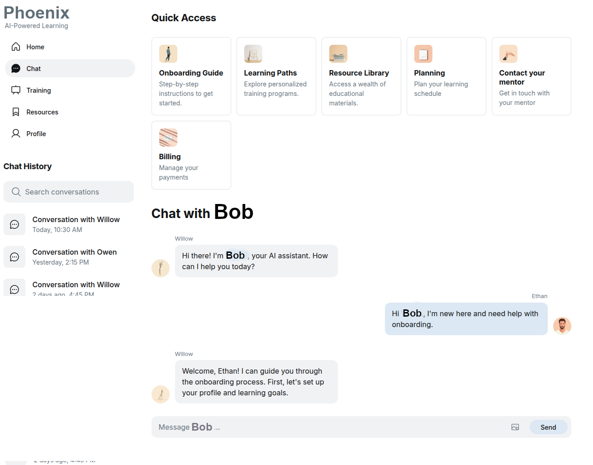

# Bob: AI-Powered Learning and Productivity Portal

Bob is an experimental web application that serves as an AI-driven learning and productivity portal for individuals and organizations. Inspired by the pilot-copilot dynamic, Bob guides users through training, resource access, and conversational support using modern LLMs and retrieval-augmented features.
Bob is a single-user proof of concept written in Python and FastAPI.


## Features

* **Conversational AI**: Chat with Bob for assistance, guidance, and quick answers on learning topics or platform features.
* **Quick Access**: One-tap navigation to onboarding, resources, learning paths, planning tools, mentor contact, and billing management.
* **Resource Integration**: Browse and search for learning materials, personalized content, and training modules.
* **User History**: View and manage your recent conversations and interactions.
* **Mobile-Friendly UI**: Fully responsive design for both desktop and mobile.
* **Extensible**: Built with FastAPI, Python, and modern frontend tooling for rapid customization.

## Example UI



## Installation

1. **Clone the repository:**

   ```bash
   git clone <repo-url>
   cd bob
   ```

2. **Install dependencies using [uv](https://github.com/astral-sh/uv):**

   ```bash
   uv sync
   ```

3. **Activate the virtual environment:**

   * **Linux/Mac:**

     ```bash
     source .venv/bin/activate
     ```
   * **Windows (cmd):**

     ```cmd
     .venv\Scripts\activate.bat
     ```
   * **Windows (PowerShell):**

     ```powershell
     .venv\Scripts\Activate.ps1
     ```

4. **Run the application:**

   ```bash
   uvicorn bob.web:app --reload
   ```

   or

   ```bash
   python -m bob
   ```

## Configuration

1. Create a `.env` file in the project root containing your OpenAI API key:

   ```dotenv
   OPENAI_API_KEY=your_key_here
   ```

2. Alternatively, set the `OPENAI_API_KEY` environment variable:

   ```bash
   export OPENAI_API_KEY=your_key_here
   ```

## License and Copyright

Copyright © 2025, Iwan van der Kleijn

This project is licensed under the MIT License. See the [LICENSE](LICENSE) file for details.

---

Let me know if you want a more playful Top Gun reference or even more minimal/technical wording!
